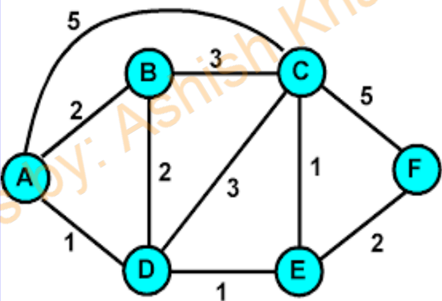
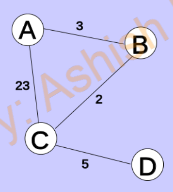

# ComputerNetworkPracticals
3150710 - GTU - Computer Network - Semester 5 - CO/IT - Engineering Practicals

## Questions and Outputs
1. Substitution Cipher
```
Original: Information Technology Department
Encrypted: afxgjeslagf lwuzfgdgyq vwhsjlewfl
Decrypted: information technology department
```
2. Transposition Cipher
```
Original: Hello World
Encrypted: Hore llWdlo_
Decrypted: Hello World_
```
3. ~Railfence Cipher~
4. Generate Frames
```
Message: 1111111111100
Frame with flags and bit stuffing: 
0111111011111011111010001111110
```
5. Error detection with Vertical Redundancy check
```
No error
Bits corrupted
```
6. Error detection with Longitudinal Redundancy check
```
No error
Corrupted bits
```
7. Error detection with Cyclic Redundancy check
```
No error
Corrupted bits
```
8. Error detection with Checksum technique
```
Data is okay
Data is corrupted
```
9. Bit stuffing
```
Message: 1111111111100
Frame with flags and bit stuffing: 
0111111011111011111010001111110
```
10. Shortest Path Routing(Dijkstra)

```
[0, 2, 3, 1, 2, 4]
```
11. Distance Vector Routing

```
[0, 3, 5, 10]
[3, 0, 2, 7]
[5, 2, 0, 5]
[10, 7, 5, 0]
```
